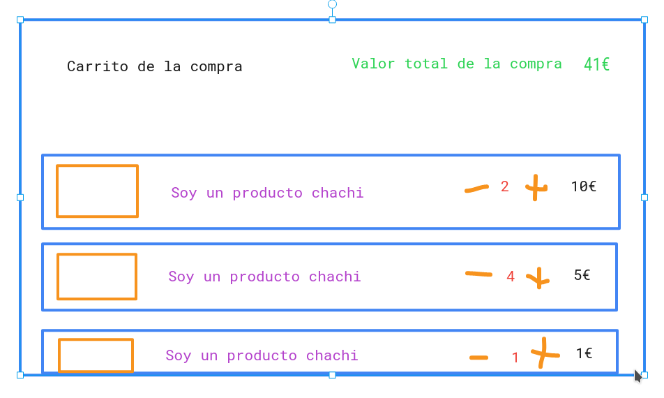

# React

## Exercices - Shopping Cart

Dado el sofisticado diseño aportado, iterar sobre las propuestas



### Prerequisitos

Haremos un diseño mobile first, y después extenderemos si disponemos de tiempo.

### Día 1

#### Primera iteración - Presentación

Crear un único componente que tenga una colección en su estado y pinte dicha colección.

El esquema de la coleccion sera el siguiente:

```javascript
{
    img: 'image.png',
    title: 'I am a good product',
    description: 'A long description',
    value: 1,
    quantity: 0
}
```

No habrá interaciones.

#### Segunda iteración - Dividir en componentes

Mantendremos nuestro componente inicial, pero crearemos uno para pintar la lista de artículos

#### Tercera iteración - Interacción

Crearemos los controles de cada elemento del carrito, donde modificaremos la cantidad de cada producto en nuestro carrito.

El listado de productos seguirá en el componente padre, así que tendremos que cambiar el estado del padre desde el hijo.
